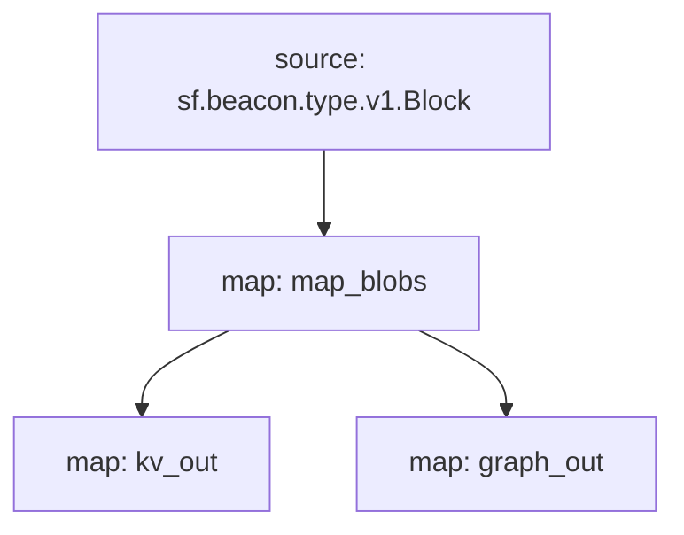

# Ethereum Blobs Substream
This substreams package offers two sink map modules:
- `kv_out` - to sink into KV store
- `graph_out` - to sink into [substreams-based Subgraph](../subgraph)

### [Latest Releases](https://github.com/pinax-network/eth-blobs/releases)

### Quick Start

```bash
> make protogen   # if needed
> make gui
```

or

```bash
> substreams gui -e goerli-cl.substreams.pinax.network:443 map_blobs -s -100
```

### Sink

To start sinking the data using KV sink into local KV store use
```bash
> task sink
```


- Or, with Docker:
```bash
> task start:docker
```


### Package Info



```yaml
Package name: eth_blobs
Version: v0.7.0
Doc: # Ethereum Blobs Substream
    This substreams package offers two sink map modules:
    - `kv_out` - to sink into KV store
    - `graph_out` - to sink into [substreams-based Subgraph](../subgraph)

Image: [embedded image: 49353 bytes]
Modules:
----
Name: map_blobs
Initial block: 0
Kind: map
Input: source: sf.beacon.type.v1.Block
Output Type: proto:pinax.ethereum.blobs.v1.Slot
Hash: 07c7426a39fad90620c4d012747cc32e4cc2d454

Name: kv_out
Initial block: 0
Kind: map
Input: map: map_blobs
Output Type: proto:sf.substreams.sink.kv.v1.KVOperations
Hash: bbbcac477a860f61dd641007346818115f86d0da

Name: graph_out
Initial block: 0
Kind: map
Input: map: map_blobs
Output Type: proto:sf.substreams.sink.entity.v1.EntityChanges
Hash: 20a07f96065e9eaf1d23ab604d09285eb5c335cc

Network: beacon

Sink config:
----
type: sf.substreams.sink.kv.v1.GenericService
configs:
- sink_config: <nil>

```
