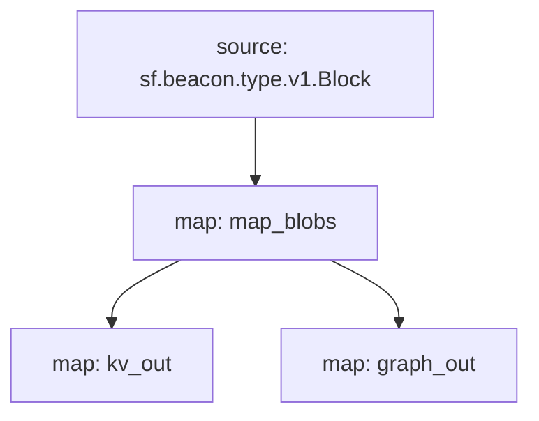

# Ethereum Blobs Substream
This substreams package offers two sink map modules:
- `kv_out` - to sink into KV store
- `graph_out` - to sink into [substreams-based Subgraph](../subgraph)

### [Latest Releases](https://github.com/pinax-network/blob-service/releases)

### Quick Start

```bash
> make protogen   # if needed
> make gui
```

or

```bash
> substreams gui -e goerli-cl.substreams.pinax.network:443 map_blobs -s -100
```

### Sink

To start sinking the data using KV sink into local KV store use
```bash
> task sink
```


- Or, with Docker:
```bash
> task start:docker
```


### Package Info



```yaml
Package name: eth_blobs
Version: v0.6.2
Doc: This substreams package lets you stream Consensus Layer EIP-4844 blobs with attached meta data.

    Among the supported chains are:
    - mainnet-cl: eth-cl.substreams.pinax.network:443
    - goerli-cl: goerli-cl.substreams.pinax.network:443
    - sepolia-cl: sepolia-cl.substreams.pinax.network:443
    - holesky-cl: holesky-cl.substreams.pinax.network:443
    - gnosis-cl: gnosis-cl.substreams.pinax.network:443
    - chiado-cl: chiado-cl.substreams.pinax.network:443

Image: [embedded image: 49353 bytes]
Modules:
----
Name: map_blobs
Initial block: 0
Kind: map
Input: source: sf.beacon.type.v1.Block
Output Type: proto:pinax.ethereum.blobs.v1.Slot
Hash: a110dc3d832afd7e85a0ff4a2d935b72b215d893

Name: kv_out
Initial block: 0
Kind: map
Input: map: map_blobs
Output Type: proto:sf.substreams.sink.kv.v1.KVOperations
Hash: 800435f53200217af6c523f95b90e10db3ac9517

Name: graph_out
Initial block: 0
Kind: map
Input: map: map_blobs
Output Type: proto:sf.substreams.entity.v1.EntityChanges
Hash: 46ef992415d463ec45bcbf6fe34b716b451b05ae

Network: goerli-cl

Sink config:
----
type: sf.substreams.sink.kv.v1.GenericService
configs:
- sink_config: <nil>
```